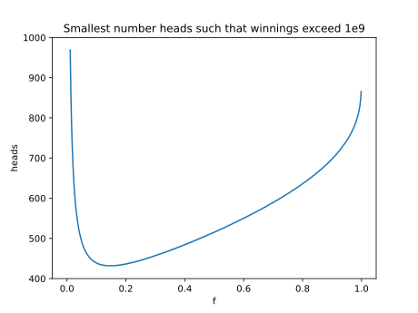

## Comments

I had so many embarrassing mistakes while working on this problem. I misread
the problem statement. I calculated the power of two incorrectly. I made an
error writing a large number in scientific notation.

With all those issues worked out though, this problem was easy to grasp. I
started by creating the equation defining how much money you will have after
$h$ coin flips landing on heads, given the value $f$.

$$(2f+1)^h\:(1-f)^{1000-h}$$

This allowed me to determine the smallest number of heads required for each
value of $f$. Plotting these values, you can easily see there is a single clear
minimum value.



From here, it is just binomial probabilities to get the answer.

## Code

```python
import math

log_1e9 = math.log(1e9)
def smallest_h(f):
    for h in range(1001):
        if h * math.log(2*f + 1) + (1000 - h) * math.log(1 - f) >= log_1e9:
            return h
    return float('nan')

def solve():
    f = 0.01
    heads = next_heads = 1000
    while next_heads <= heads:
        f += 0.01
        heads, next_heads = next_heads, smallest_h(f)

    prob = 0
    for h in range(heads, 1001):
        prob += math.comb(1000, h)
    prob /= 1 << 1000

    return round(prob, 12)

if __name__ == '__main__':
    print(solve())
```
