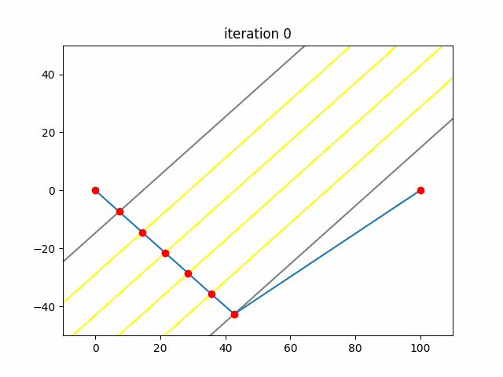

## Comments

I'm currently taking a Machine Learning course at Portland State.  We learned
about Gradient Descent and its use in optimizing neural networks.  I wanted to
try my hand at a problem here that could also be solved using Gradient Descent.

The first thing I did was rotate the map 45 degrees so that the marsh was
vertical.  I then defined variables for the locations on the marsh boundaries
where Sam and Frodo moved from one speed to another. Because the fastest way
between any two points with a constant velocity is a straight line, these six
points were all that was necessary to define their trip. Using these variables,
I was then able to calculate the time it would take them to get from A to B
along any given path.

Now that I had a single equation, all I needed to do was find its minimum
value.  Using the Gradient Descent algorithm, this meant taking the partial
derivative with respect to each variable in turn. This gradient is then
subtracted from the variable. Where $F$ is the equation to optimize:

$$a_{i+1}=a_i-\nabla F(a_i)=a_i-\frac{\partial}{\partial a_i}F(a_i)$$

What this process does is iteratively find smaller and smaller values for the
function. At each iteration, it finds the direction with the steepest descent
and inches its way forward in that direction.  This is analogous to a ball
rolling down a hill until it finds the bottom. This gif represents Sam and
Frodo's path as the algorithm progresses.



From here it was just taking the partial derivatives and solving. Runs in about
40 milliseconds with Pypy3.

## Code

```python
alpha = (25*(2**0.5) - 25)**2
beta = 50 * (2**0.5)

def solve():
    a = b = c = d = e = f = 0.001
    timemin = float('inf')

    while True:
        time = 1/10 * (alpha + a**2)**0.5 + \
                1/9 * (100 + (b - a)**2)**0.5 + \
                1/8 * (100 + (c - b)**2)**0.5 + \
                1/7 * (100 + (d - c)**2)**0.5 + \
                1/6 * (100 + (e - d)**2)**0.5 + \
                1/5 * (100 + (f - e)**2)**0.5 + \
                1/10 * (alpha + (beta - f)**2)**0.5
        if time < timemin:
            timemin = time
        elif time == timemin:
            break

        a -= 1/10 * a * (alpha + a**2)**(-0.5) + \
                1/9 * (a - b) * (100 + (a - b)**2)**(-0.5)
        b -= 1/9 * (b - a) * (100 + (b - a)**2)**(-0.5) + \
                1/8 * (b - c) * (100 + (b - c)**2)**(-0.5)
        c -= 1/8 * (c - b) * (100 + (c - b)**2)**(-0.5) + \
                1/7 * (c - d) * (100 + (c - d)**2)**(-0.5)
        d -= 1/7 * (d - c) * (100 + (d - c)**2)**(-0.5) + \
                1/6 * (d - e) * (100 + (d - e)**2)**(-0.5)
        e -= 1/6 * (e - d) * (100 + (e - d)**2)**(-0.5) + \
                1/5 * (e - f) * (100 + (e - f)**2)**(-0.5)
        f -= 1/5 * (f - e) * (100 + (f - e)**2)**(-0.5) + \
                1/10 * (f - beta) * (alpha + (f - beta)**2)**(-0.5)

    return round(timemin, 10)

if __name__ == '__main__':
    print(solve())
```
